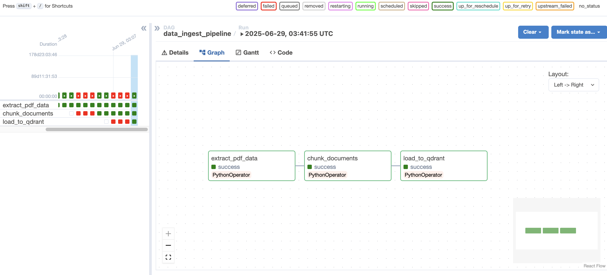

# 📊 RAG Airflow Pipeline

<div align="center">
  


*A Retrieval Augmented Generation pipeline built with Apache Airflow and Qdrant*

[](https://www.python.org/)
[](https://airflow.apache.org/)
[](https://qdrant.tech/)
[](LICENSE)

</div>

## 🌟 Overview

This project implements a Retrieval Augmented Generation (RAG) system using Apache Airflow for workflow orchestration and Qdrant as the vector database. The pipeline extracts text from PDFs, chunks it into manageable pieces, creates embeddings, and stores them in Qdrant for semantic search capabilities.

## 📂 Project Structure

```
rag_airflow/
├── dags/                  # Airflow DAG definitions
├── etl/                   # ETL components
│   ├── extract/           # Data extraction (PDF, URLs, etc.)
│   ├── transform/         # Text transformation (chunking, cleaning)
│   ├── embed/             # Vector embedding generation
│   └── load/              # Vector storage (to Qdrant)
├── common/                # Shared utilities
├── data/                  # Sample data files
├── docs/                  # Documentation
│   └── images/            # Screenshots and diagrams
└── tests/                 # Unit tests
```

## ✨ Features

- **📄 Data Extraction**: Extract text from PDFs, URLs, and other sources
- **🔪 Text Chunking**: Split documents into optimal chunks for embedding
- **🧹 Text Cleaning**: Normalize and prepare text for embedding
- **🧠 Vector Embedding**: Create vector embeddings using various models
- **🔍 Vector Storage**: Store and query vectors in Qdrant database
- **🔄 Workflow Orchestration**: Manage the entire pipeline with Airflow

## 🚀 Getting Started

### Prerequisites

- Docker
- Python 3.11+
- Git

### Installation

1. **Clone the repository**:
   ```bash
   git clone https://github.com/debrup-ai/data_ingestion.git
   cd data_ingestion/rag_airflow
   ```

2. **Create and activate a virtual environment**:
   ```bash
   python -m venv venv
   source venv/bin/activate  # On Windows: venv\Scripts\activate
   ```

3. **Install dependencies**:
   ```bash
   pip install -r requirements.txt
   ```

### 🐳 Setting Up Qdrant

1. **Pull the Qdrant Docker image**:
   ```bash
   docker pull qdrant/qdrant
   ```

2. **Create a directory for persistent storage**:
   ```bash
   mkdir -p ~/qdrant_storage
   ```

3. **Start the Qdrant container**:
   ```bash
   docker run -d -p 6333:6333 -p 6334:6334 \
       -v ~/qdrant_storage:/qdrant/storage \
       --name qdrant qdrant/qdrant
   ```

4. **Verify Qdrant is running**:
   ```bash
   curl http://localhost:6333/
   ```

   You can also access the Qdrant dashboard at: http://localhost:6333/dashboard

### 🌬️ Setting Up Airflow

1. **Initialize the Airflow database**:
   ```bash
   export AIRFLOW_HOME=$(pwd)
   airflow db init
   ```

2. **Create an Airflow user**:
   ```bash
   airflow users create \
       --username admin \
       --password admin \
       --firstname Admin \
       --lastname User \
       --role Admin \
       --email admin@example.com
   ```

3. **Start Airflow services** (alternatively, use the provided script):
   ```bash
   # Start the webserver
   airflow webserver -p 8080 -D
   
   # Start the scheduler
   airflow scheduler -D
   ```
   
   Or use the provided script:
   ```bash
   ./start_airflow.sh
   ```

4. **Access the Airflow UI**:
   Open your browser and visit: http://localhost:8080
   - Username: admin
   - Password: admin

### 🏃‍♀️ Running the RAG Pipeline

1. **Prepare your data**:
   - Place your PDF files in the `data/` directory
   
2. **Trigger the DAG** with configuration:
   ```bash
   # Via command line
   airflow dags trigger data_ingest_pipeline \
     --conf '{"pdf_file": "/path/to/your/document.pdf"}'
   
   # Or via the Airflow UI:
   # 1. Go to http://localhost:8080/dags/data_ingest_pipeline
   # 2. Click "Trigger DAG w/ config"
   # 3. Add JSON: {"pdf_file": "/path/to/your/document.pdf"}
   ```

3. **Monitor execution**:
   - Follow the progress in the Airflow UI
   - Check task logs for details

4. **Query Qdrant**:
   ```bash
   curl -X POST http://localhost:6333/collections/documents/points/search \
     -H 'Content-Type: application/json' \
     -d '{"vector": [0.2, 0.1, ..., 0.3], "limit": 5}'
   ```

## 📝 Common Airflow Commands for Beginners

```bash
# List all DAGs
airflow dags list

# Display DAG details
airflow dags show data_ingest_pipeline

# List tasks in a DAG
airflow tasks list data_ingest_pipeline

# Test a specific task
airflow tasks test data_ingest_pipeline extract_pdf_data 2023-01-01

# Pause/unpause a DAG
airflow dags pause data_ingest_pipeline
airflow dags unpause data_ingest_pipeline

# Clear task instances
airflow tasks clear data_ingest_pipeline --task_regex extract_pdf_data

# Restart Airflow webserver or scheduler
airflow webserver -D
airflow scheduler -D

# Stop Airflow services
pkill -f airflow
# Or use the provided script
./stop_airflow.sh
```

## 🧪 Development

To contribute to this project:

1. **Create a new branch**:
   ```bash
   git checkout -b feature/your-feature-name
   ```

2. **Make your changes**

3. **Run tests**:
   ```bash
   pytest tests/
   ```

4. **Submit a pull request**

## 📋 Usage Examples

### Example 1: Processing a PDF

```bash
# Via Airflow CLI:
airflow dags trigger data_ingest_pipeline \
  --conf '{"pdf_file": "/home/zudu/data_ingestion/rag_airflow/data/sample.pdf"}'
```

### Example 2: Querying Embedded Documents

```python
from qdrant_client import QdrantClient

# Connect to Qdrant
client = QdrantClient(url="http://localhost:6333")

# Search for similar documents
results = client.search(
    collection_name="documents",
    query_vector=[0.2, 0.1, ..., 0.3],
    limit=5
)

# Print results
for result in results:
    print(f"Score: {result.score}, Document: {result.payload.get('text')[:100]}...")
```

## 📚 Resources

- [Apache Airflow Documentation](https://airflow.apache.org/docs/apache-airflow/stable/index.html)
- [Qdrant Documentation](https://qdrant.tech/documentation/)
- [LlamaIndex Documentation](https://docs.llamaindex.ai/)

## 🤝 Contributing

Contributions are welcome! Feel free to open issues or submit pull requests.

## 📄 License

This project is licensed under the MIT License.
